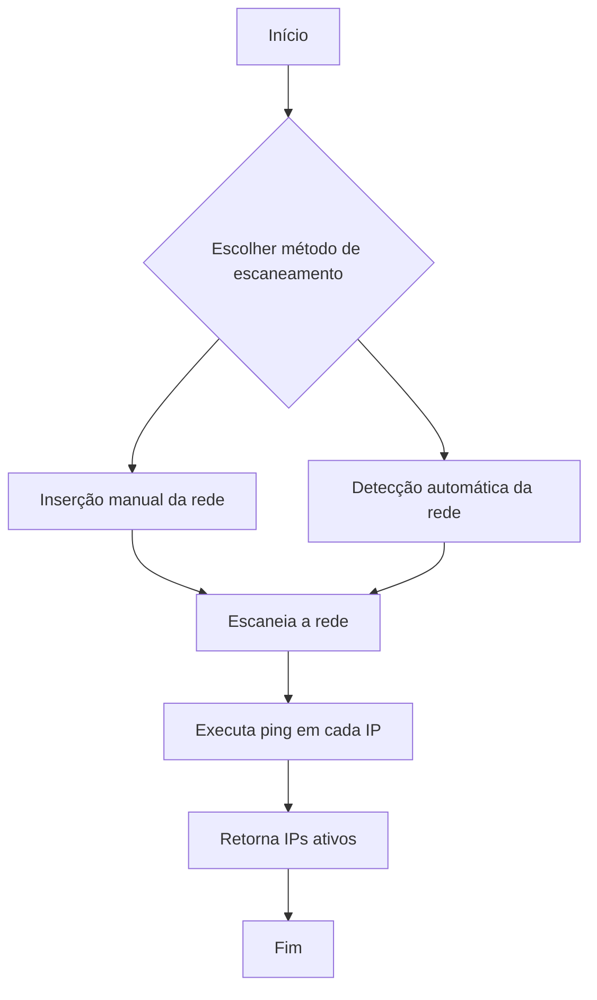

# Network Scanner

Este script escaneia a rede local para identificar os IPs ativos. Ele pode detectar automaticamente a rede baseada na interface de rede da máquina ou permitir que o usuário insira manualmente o endereço da rede.

## Funcionalidades

- Descoberta automática da rede utilizando a interface de rede da máquina.
- Entrada manual para definir a rede a ser escaneada.
- Uso de `ping` para verificar quais IPs estão ativos na rede.
- Execução paralela para melhorar a performance do escaneamento.

## Dependências

Certifique-se de instalar as bibliotecas necessárias antes de executar o script:

```bash
pip install netifaces
```

## Como Usar

Execute o script com:

```bash
python scanner.py
```

Ao iniciar, você terá duas opções:
1. Inserir manualmente a rede (ex: `192.168.1.0/24`)
2. Detectar automaticamente a rede com base na configuração do seu dispositivo

Após a escolha, o script realizará o escaneamento e exibirá os IPs ativos.

## Fluxo do Código



## Funções Principais

### `get_local_network()`
Obtém automaticamente o endereço IP e máscara de sub-rede para definir a rede a ser escaneada.

### `ping_host(ip: str)`
Executa um ping no IP informado para verificar se ele está ativo.

### `scan_network(network: str)`
Escaneia todos os IPs na faixa de rede e retorna os IPs que responderam ao ping.

### `main()`
Gerencia o fluxo do programa, permitindo ao usuário escolher entre inserção manual ou detecção automática da rede.

## Exemplo de Saída

```bash
Escolha uma opção:
1. Inserir manualmente o endereço da rede
2. Detectar automaticamente a rede
Digite 1 ou 2: 2
Rede detectada automaticamente: 192.168.1.0/24
Escaneando a rede...
IPs ativos encontrados na rede:
192.168.1.1
192.168.1.10
192.168.1.15
```

## Observações
- Certifique-se de que a interface de rede correta está definida no código (`wlp1s0` pode precisar ser alterado para `eth0` ou outro nome dependendo do seu sistema).
- O script utiliza `ThreadPoolExecutor` para aumentar a velocidade do escaneamento.

## Licença
Este projeto está sob a licença MIT.
